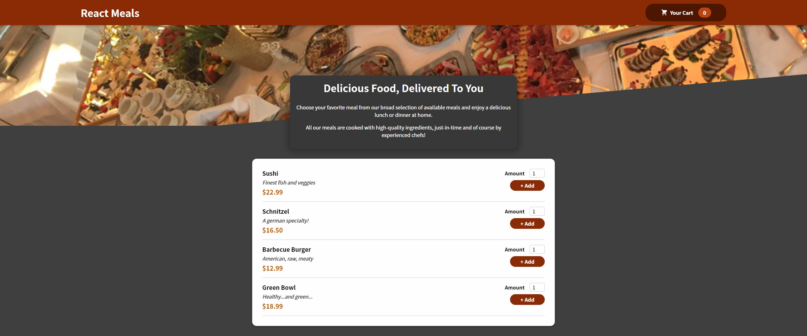

# FA.react-FoodOrderApp

Projeto em React para exercitar conceitos simples e complexos de hooks. 



Para fazer a aplicação funcional é necessário ter **npm** instalado.

Para a instalação das dependências, executar na pasta raiz do projeto, via linha de comando: 
```
npm install
```
e depois 
```
npm start
```

